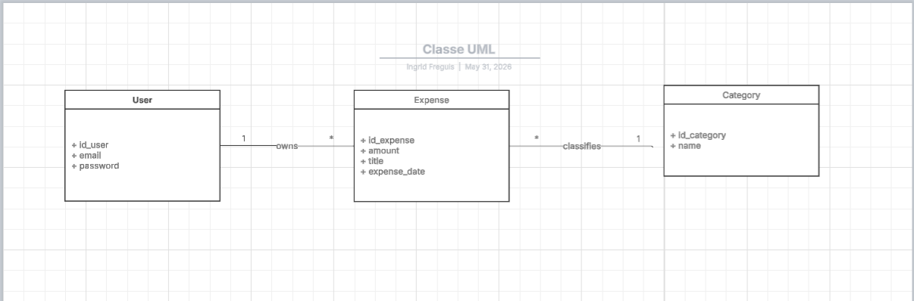

<div align="center">


# Gestio — Expense Tracker

**A minimalist personal expense tracker** — vanilla PHP · MySQL · Bootstrap, fully containerized for portable, secure local development.


</div>

---

## Table of Contents

- [Gestio — Expense Tracker](#gestio--expense-tracker)
  - [Table of Contents](#table-of-contents)
  - [About](#about)
  - [Tech Stack](#tech-stack)
  - [Architecture](#architecture)
  - [Database Schema](#database-schema)
  - [Prerequisites](#prerequisites)
  - [Quick Start](#quick-start)
  - [URLs](#urls)
  - [Environment Variables](#environment-variables)
  - [Project Structure](#project-structure)
  - [Development Workflow](#development-workflow)
  - [Production Deployment](#production-deployment)
  - [Useful zsh Aliases](#useful-zsh-aliases)
  - [Troubleshooting](#troubleshooting)
  - [Security Considerations](#security-considerations)
  - [License](#license)
  - [About the Author](#about-the-author)

---

## About

**Gestio** is a self-hosted expense tracker designed as a portfolio project demonstrating:

- Full-stack development with **vanilla PHP** (no framework — by design)
- Production-grade Docker orchestration with **dev/prod separation**
- Security-first configuration (secrets management, hardened containers)
- Clean separation of concerns (code / config / secrets)

Built as part of my full-stack developer reconversion journey ([codingqueen40.com](https://codingqueen40.com)).

---

## Tech Stack

| Layer | Technology |
|---|---|
| Frontend | Bootstrap 5.3, vanilla JS |
| Backend | PHP 8.4 (Apache 2.4) |
| Database | MySQL 8.4 LTS |
| Admin UI | phpMyAdmin (dev only) |
| Container runtime | Docker Compose v2 (OrbStack on macOS) |
| Editor | VSCode |

---

## Architecture

```
┌────────────────────────────────────────────────────────┐
│                    Your Mac (host)                     │
│                                                        │
│   ~/secrets/gestio/.env  ← chmod 700, never in git     │
│                                                        │
│   Docker network: gestio_network (isolated bridge)     │
│   ┌──────────────┐   ┌──────────────┐   ┌──────────┐   │
│   │  gestio_php  │←→ │ gestio_mysql │   │  pma     │   │
│   │  PHP 8.4     │   │  MySQL 8.4   │←──│  (dev)   │   │
│   │  Apache      │   │              │   │          │   │
│   │  :8080       │   │  (no public  │   │  :8081   │   │
│   │              │   │   port)      │   │          │   │
│   └──────────────┘   └──────────────┘   └──────────┘   │
│         ↑                  ↑                  ↑        │
│      localhost          internal           localhost   │
└────────────────────────────────────────────────────────┘
```

---

## Database Schema

The data model (conceptual / MCD):

<div align="center">
  
</div>

Two tables — `categories` and `depenses` (expenses) — linked by a foreign key
(`depenses.categorie_id → categories.id`, `ON DELETE SET NULL`). The full schema and
seed data live in [`db/init.sql`](db/init.sql), which runs automatically on the first boot.

---

## Prerequisites

- **macOS** with [OrbStack](https://orbstack.dev) (or Docker Desktop on Linux/Windows)
- **Docker Compose v2**
- **zsh** (default macOS shell) for the optional aliases
- ~500 MB free disk space

---

## Quick Start

```bash
# 1. Clone the repo
git clone https://github.com/codingqueen40/gestio.git
cd gestio

# 2. Set up your secrets (outside the repo)
mkdir -p ~/secrets/gestio
cp .env.example ~/secrets/gestio/.env
chmod 700 ~/secrets
# Edit ~/secrets/gestio/.env with strong passwords (min 20 chars recommended)

# 3. Launch the dev stack
docker compose --env-file ~/secrets/gestio/.env up -d

# 4. Open in browser
open http://localhost:8080
```

**First boot:** ~30 seconds (MySQL initializes the schema from `db/init.sql`).

---

## URLs

| Service | URL | Notes |
|---|---|---|
| App | http://localhost:8080 | Your PHP code in `public/` |
| phpMyAdmin | http://localhost:8081 | Dev only — login required |
| MySQL | localhost:3306 | For DBeaver, Workbench, etc. |

> The app port is configurable via `PHP_PORT` in your `.env` (e.g. set `PHP_PORT=8090`
> if another web server already holds `8080` on your machine).

---

## Environment Variables

All secrets live in `~/secrets/gestio/.env` (outside the repo). The repo only ships `.env.example` as a template.

| Variable | Purpose |
|---|---|
| `MYSQL_ROOT_PASSWORD` | MySQL root account |
| `MYSQL_DATABASE` | Database name |
| `MYSQL_USER` | Application user |
| `MYSQL_PASSWORD` | Application user password |
| `PHP_PORT` | Host port for the app (default 8080) |
| `MYSQL_PORT` | Host port for MySQL (default 3306) |
| `PMA_PORT` | Host port for phpMyAdmin (default 8081) |

---

## Project Structure

```
gestio/
├── docker-compose.yml          # Base config (shared between dev and prod)
├── docker-compose.override.yml # Dev config (auto-loaded) — adds phpMyAdmin, exposes ports
├── docker-compose.prod.yml     # Prod config (explicit) — hardened, no phpMyAdmin
├── Dockerfile                  # Custom PHP image (mysqli, PDO, mod_rewrite)
├── .env.example                # Template, safe to commit
├── .gitignore                  # Excludes .env, .DS_Store, etc.
├── README.md                   # You are here
├── db/
│   └── init.sql                # Initial schema + sample data (runs once)
├── php/
│   └── dev.ini                 # Dev-only PHP overrides (enables display_errors)
└── public/                     # Apache document root
    ├── index.php               # Application entry point
    └── config.php              # PDO connection (reads env vars)
```

---

## Development Workflow

```bash
# Daily commands (loads dev override automatically)
docker compose --env-file ~/secrets/gestio/.env up -d       # start
docker compose --env-file ~/secrets/gestio/.env down        # stop
docker compose --env-file ~/secrets/gestio/.env logs -f php # tail logs

# Wipe data and restart fresh (rerun init.sql)
docker compose --env-file ~/secrets/gestio/.env down -v
```

---

## Production Deployment

```bash
# Explicitly load prod config, override.yml is ignored
docker compose \
  --env-file ~/secrets/gestio/.env \
  -f docker-compose.yml \
  -f docker-compose.prod.yml \
  up -d
```

**Production differs from dev by:**

- No phpMyAdmin (never exposed publicly)
- MySQL port not exposed externally
- `display_errors` stays **off** (errors logged, never shown to visitors)
- `no-new-privileges` security flag enabled
- `restart: always` (auto-restart after host reboot)
- Stricter password hashing (`caching_sha2_password`)

**Before deploying:** put a reverse proxy (Caddy or Traefik) in front for HTTPS via Let's Encrypt.

---

## Useful zsh Aliases

Optional — add to `~/.zshrc` for ergonomic shortcuts:

```bash
export GESTIO_DIR="$HOME/Projets/gestio"
export GESTIO_ENV="$HOME/secrets/gestio/.env"

alias gestio='cd $GESTIO_DIR'
alias gestio-up='docker compose --env-file $GESTIO_ENV -f $GESTIO_DIR/docker-compose.yml -f $GESTIO_DIR/docker-compose.override.yml up -d'
alias gestio-down='docker compose --env-file $GESTIO_ENV -f $GESTIO_DIR/docker-compose.yml -f $GESTIO_DIR/docker-compose.override.yml down'
alias gestio-logs='docker compose --env-file $GESTIO_ENV -f $GESTIO_DIR/docker-compose.yml -f $GESTIO_DIR/docker-compose.override.yml logs -f'
alias gestio-shell='docker exec -it gestio_php bash'
# Credentials are read from the container's own env — always match your .env
alias gestio-db='docker exec -it gestio_mysql sh -c '\''mysql -u"$MYSQL_USER" -p"$MYSQL_PASSWORD" "$MYSQL_DATABASE"'\'''
```

Then: `source ~/.zshrc` and you can type `gestio-up` instead of the long command.

---

## Troubleshooting

| Symptom | Cause | Fix |
|---|---|---|
| `It works!` page instead of the app | Another web server on the host (often a native/Homebrew Apache) already answers on the port — the browser never reaches the container | Find it: `lsof -nP -iTCP:8080 -sTCP:LISTEN`. Stop it (`brew services stop httpd`) or set a different `PHP_PORT` in `.env`. Tip: the container responds `Server: …(Debian)`; a native Apache shows `…(Unix)` |
| `Connection refused` from PHP | MySQL not ready yet | Wait 10 sec — the healthcheck handles dependency ordering normally |
| `unauthorized` on phpMyAdmin | Wrong credentials | Use the values from `~/secrets/gestio/.env` |
| Port 8080 already in use | Another process holds it | `lsof -i :8080` to find it, or change `PHP_PORT` in `.env` |
| Changes to `init.sql` ignored | Schema only runs on first boot | `docker compose down -v && up -d` (wipes data) |
| `.env` variables not loaded | Missed `--env-file` flag | Always include `--env-file ~/secrets/gestio/.env` or use the aliases |

---

## Security Considerations

This project follows a defense-in-depth approach:

- **Secrets isolation** — `.env` lives in `~/secrets/` (chmod 700), never in the repo
- **No `.env` in git history** — enforced by `.gitignore`
- **Container hardening** — `no-new-privileges` flag in prod
- **Network isolation** — MySQL not exposed externally in prod
- **No phpMyAdmin in prod** — eliminates the #1 bot-attacked surface
- **No error disclosure** — `display_errors` is off by default; SQL errors are logged, never shown to visitors
- **Prepared statements** — all SQL via PDO with `ATTR_EMULATE_PREPARES = false` (real prepared statements at MySQL level)
- **HTML escaping** — all user output through `htmlspecialchars()`
- **Strict config** — fails loudly if env vars are missing (no silent fallback to insecure defaults)

---

## License

[MIT](LICENSE) — Use freely, attribution appreciated.

---

## About the Author

**Ingrid Freguis** ([@codingqueen40](https://github.com/codingqueen40))

Full-stack developer in reconversion at 48, building a tech career while raising 3 kids solo. Currently preparing CompTIA Security+ and AWS SAA-C03 certifications. Studying Mandarin (HSK 2). Long-term goal: tech expat role in Asia.

- Blog: [codingqueen40.com](https://codingqueen40.com)
- LinkedIn: [linkedin.com/in/codingqueen40](https://linkedin.com/in/codingqueen40)
- GitHub: [github.com/codingqueen40](https://github.com/codingqueen40)

> "Code is the closest thing we have to magic — and it's never too late to learn it."
